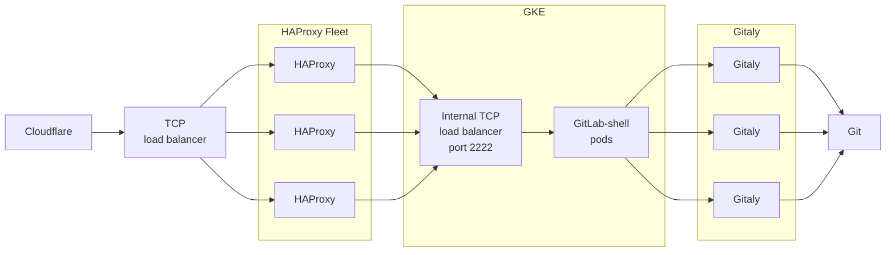

# GitLab Shell

[](https://gitlab.com/gitlab-org/gitlab-shell/-/pipelines?ref=main)
[](https://gitlab.com/gitlab-org/gitlab-shell/-/pipelines?ref=main)
[](https://codeclimate.com/github/gitlabhq/gitlab-shell)

GitLab Shell handles git SSH sessions for GitLab and modifies the list of authorized keys.
GitLab Shell is not a Unix shell nor a replacement for Bash or Zsh.

GitLab supports Git LFS authentication through SSH.

## Requirements

GitLab Shell is written in Go, and needs a Go compiler to build. It still requires
Ruby to build and test, but not to run.

GitLab Shell runs on `port 22` on an Omnibus installation. To use a regular SSH
service, configure it on an alternative port.

Download and install the current version of Go from [golang.org](https://golang.org/dl/)
We follow the [Golang Release Policy](https://golang.org/doc/devel/release.html#policy)
of supporting the current stable version and the previous two major versions.

## How GitLab Shell works

When you access the GitLab server over SSH then GitLab Shell will:

1. Limit you to predefined git commands (`git push`, `git pull`, `git fetch`).
1. Call the GitLab Rails API to check if you are authorized, and what Gitaly server your repository is on
1. Copy data back and forth between the SSH client and the Gitaly server

If you access a GitLab server over HTTP(S) you end up in [gitlab-workhorse](https://gitlab.com/gitlab-org/gitlab/tree/master/workhorse).

### `git pull` over SSH

1. git pull over SSH -> gitlab-shell -> API call to gitlab-rails (Authorization) -> accept or decline -> establish Gitaly session

### `git push` over SSH

1. git push over SSH -> gitlab-shell (git command is not executed yet) -> establish Gitaly session -> (in Gitaly) gitlab-shell pre-receive hook -> API call to gitlab-rails (authorization) -> accept or decline push

[Full feature list](doc/features.md)

### Modifies `authorized_keys`

GitLab Shell modifies the `authorized_keys` file on the client machine.

## Rate Limiting

GitLab Shell performs rate-limiting by user account and project for git operations. GitLab Shell accepts git operation requests and then makes a call to the Rails rate-limiter (backed by Redis). If the `user + project` exceeds the rate limit then GitLab Shell will then drop further connection requests for that `user + project`.

The rate-limiter is applied at the git command (plumbing) level. Each command has a rate limit of 600/minute. For example, `git push` has 600/minute and `git pull` has another 600/minute.

Because they are using the same plumbing command `git-upload-pack`, `git pull` and `git clone` are in effect the same command for the purposes of rate-limiting.

There is also a rate-limiter in place in Gitaly, but the calls will never be made to Gitaly if the rate limit is exceeded in Gitlab Shell (Rails).

## GitLab SaaS

A diagram of the flow of `gitlab-shell` on GitLab.com:



## Commands

- `make check`: Checks if GitLab API access and Redis (via internal API) can be reached
- `make compile`: Builds the `gitlab-shell` binaries, placing them into `bin/`.
- `make install`: Builds the `gitlab-shell` binaries and installs them onto the
  file system. The default location is `/usr/local`, but you can change it with the `PREFIX`
  and `DESTDIR` environment variables.
- `make setup`: Don't run this command unless instructed to by your installation method
  documentation. Used when installing GitLab from source on a single machine. Compiles
  the `gitlab-shell` binaries, and ensures that file system paths exist and contain
  correct permissions.

## Testing

Run tests:

```shell
bundle install
make test
```

Run `gofmt`:

```shell
make verify
```

Run both test and verify (the default Makefile target):

```shell
bundle install
make validate
```

### Gitaly requirements for tests

Some tests need a Gitaly server. The
[`docker-compose.yml`](docker-compose.yml) file runs Gitaly on port 8075.
To tell the tests the location of Gitaly, set `GITALY_CONNECTION_INFO`:

```plaintext
export GITALY_CONNECTION_INFO='{"address": "tcp://localhost:8075", "storage": "default"}'
make test
```

If no `GITALY_CONNECTION_INFO` is set, the test suite still runs, but any
tests requiring Gitaly are skipped. These tests always run in the CI environment.

## Releasing

See [PROCESS.md](./PROCESS.md)

## Contributing

- See [CONTRIBUTING.md](./CONTRIBUTING.md).
- See the [beginner's guide](doc/beginners_guide.md).

## License

See [LICENSE](./LICENSE).

## Related topics

- [Using the GitLab Shell chart](https://docs.gitlab.com/charts/charts/gitlab/gitlab-shell/#using-the-gitlab-shell-chart)
