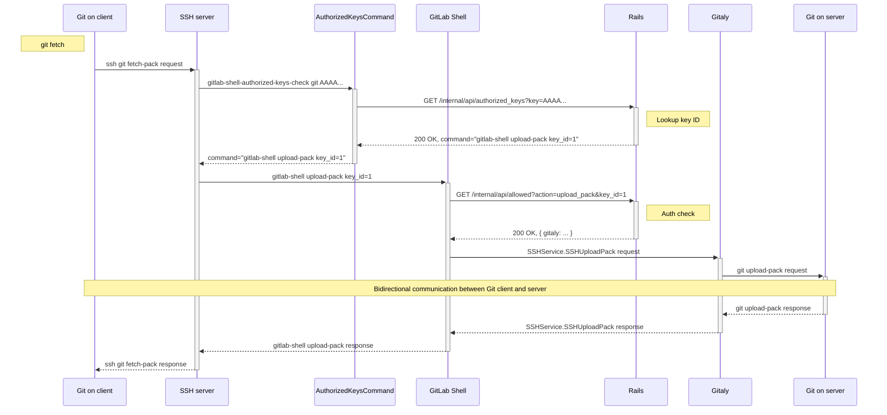

# GitLab Shell architecture

```mermaid
sequenceDiagram
    participant Git on client
    participant SSH server
    participant AuthorizedKeysCommand
    participant GitLab Shell
    participant Rails
    participant Gitaly
    participant Git on server

    Note left of Git on client: git fetch
    Git on client->>+SSH server: ssh git fetch-pack request
    SSH server->>+AuthorizedKeysCommand: gitlab-shell-authorized-keys-check git AAAA...
    AuthorizedKeysCommand->>+Rails: GET /internal/api/authorized_keys?key=AAAA...
    Note right of Rails: Lookup key ID
    Rails-->>-AuthorizedKeysCommand: 200 OK, command="gitlab-shell upload-pack key_id=1"
    AuthorizedKeysCommand-->>-SSH server: command="gitlab-shell upload-pack key_id=1"
    SSH server->>+GitLab Shell: gitlab-shell upload-pack key_id=1
    GitLab Shell->>+Rails: GET /internal/api/allowed?action=upload_pack&key_id=1
    Note right of Rails: Auth check
    Rails-->>-GitLab Shell: 200 OK, { gitaly: ... }
    GitLab Shell->>+Gitaly: SSHService.SSHUploadPack request
    Gitaly->>+Git on server: git upload-pack request
    Note over Git on client,Git on server: Bidirectional communication between Git client and server
    Git on server-->>-Gitaly: git upload-pack response
    Gitaly -->>-GitLab Shell: SSHService.SSHUploadPack response
    GitLab Shell-->>-SSH server: gitlab-shell upload-pack response
    SSH server-->>-Git on client: ssh git fetch-pack response
```
